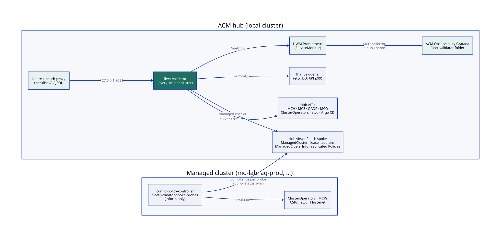
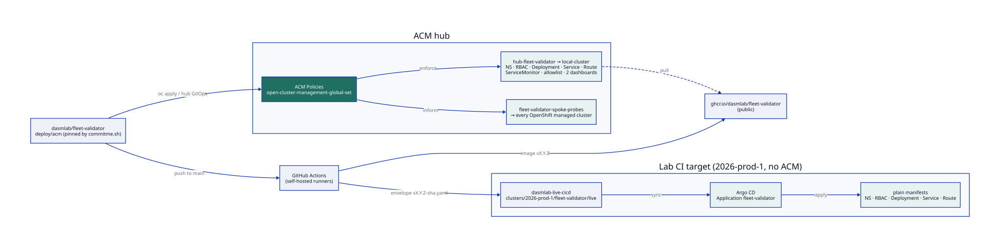

# fleet-validator

Continuous production-readiness checks for a Red Hat ACM hub and every cluster it manages,
exported as Prometheus metrics and shown in two Grafana dashboards.



fleet-validator runs as one pod on the ACM hub. Every minute it validates the hub
(`local-cluster`) and each ManagedCluster that is accepted and joined. Starts are spread over
the interval, and a few clusters run at a time, so a large fleet doesn't hit the hub API all at
once. Each cluster gets a checklist report with a weighted score, a READY verdict and one result
per check. The reports are served on `/metrics`, a JSON API and a small read-only UI.

There is no CRD and no spoke credentials. Everything about a managed cluster is read on the hub:
its ManagedCluster conditions, lease, add-ons and `ManagedClusterInfo`, plus the results of an
inform-only probe policy that runs on the spoke and reports back through normal policy status.

Everything is delivered through ACM policies: the Deployment, Service, Route, RBAC,
ServiceMonitor, MCO allowlist and dashboards. Argo CD applies those policies from the GitOps repo.

## Checks

The full list (check ids, severities, pass conditions, `oc` equivalents) and the backlog of
candidate checks are in **[docs/CHECKLIST.md](docs/CHECKLIST.md)**. In short:

| Cluster | Groups |
|---|---|
| Hub (`local-cluster`) | Platform, ACM Hub, Backup & DR, Observability, Governance, GitOps, Fleet |
| Managed cluster | Registration, Agents & Add-ons, Platform, Governance |

**Scoring.** The weights are critical 5, warning 2 and info 1. A pass scores the full weight, a
warn half and a fail zero. A skip (API not installed, probe policy not placed, no data) is left
out of the score. A cluster is **READY** when no critical check fails.

**Governance.** Every cluster must have policies placed on it, all of them Compliant, with at
least 1 OperatorPolicy and 1 ConfigurationPolicy by default. The minimums can be changed
globally or per cluster in the config, or with ManagedCluster annotations (see below).

**Spoke probes.** The checks marked "(probe)" come from the policy
`fleet-validator-spoke-probes` (`deploy/acm/policy-spoke-probes.yaml`). It is placed on every
OpenShift ManagedCluster except the hub and only uses `inform`, so it never changes anything on
the spoke. Each of its ConfigurationPolicies is one check; the hub reads the per-template result
from the replicated policy's `status.details`. If the probe policy isn't placed on a cluster,
those checks report skip.

## Configuration

All settings are optional. The file is mounted from the ConfigMap `fleet-validator-config` and
passed with `--config`; the values below are the defaults.

```yaml
interval: 1m                 # time between validations of the same cluster (min 10s)
concurrency: 4               # clusters validated at the same time
hubName: local-cluster       # used when the hub has no local-cluster ManagedCluster
probePolicy: fleet-validator-spoke-probes   # probe Policy name (any namespace), or namespace.name
requiredAddons:
  - work-manager
  - governance-policy-framework
  - config-policy-controller
governance:
  default:
    minOperatorPolicies: 1
    minConfigurationPolicies: 1
  clusters:                  # per-cluster overrides
    lab-sno-1:
      minOperatorPolicies: 0
      minConfigurationPolicies: 4
thresholds:
  apiP99Seconds: 1
  etcdDBWarnBytes: 1073741824    # 1 GiB
  etcdDBFailBytes: 6442450944    # 6 GiB
  leaseStaleSeconds: 300
  csrPendingGraceMinutes: 15
  backupMaxAgeHours: 26
disabledChecks: []           # check ids, e.g. hub.gitops.gitopscluster
prometheusURL: https://thanos-querier.openshift-monitoring.svc:9091
```

### ManagedCluster annotations

Annotations win over the config, which lets the provisioning flow set the governance minimums on
the cluster itself:

```yaml
metadata:
  annotations:
    fleet-validator.dasmlab.org/min-operator-policies: "1"
    fleet-validator.dasmlab.org/min-configuration-policies: "6"
    fleet-validator.dasmlab.org/skip: "true"   # leave this cluster out entirely
```

### Flags

| Flag | Default | Meaning |
|---|---|---|
| `--config` | none | YAML config path |
| `--http-bind-address` | `:8090` | `/metrics`, `/healthz`, `/readyz` (plus the UI/API unless `--ui-bind-address` is set) |
| `--ui-bind-address` | none | Separate UI/API listener, e.g. `127.0.0.1:8091` behind oauth-proxy |
| `--kubeconfig`, `--context` | in-cluster | For out-of-cluster runs |
| `--prometheus-url` | from config | Thanos querier URL |
| `--prometheus-ca` | service CA | Comma-separated extra CA bundles for the Thanos connection |
| `--no-prometheus` | false | Skip the metric-based checks (etcd DB size, API p99) |
| `--once` | false | Validate every cluster once, print the reports as JSON and exit |
| `--print-metric-names` | false | Print the exported metric names (the MCO allowlist) and exit |

The metric-based checks only run in-cluster, because they authenticate to the Thanos querier with
the pod's ServiceAccount token. Out of cluster they report skip.

## UI and API

In the deployed setup the UI and API listen on `127.0.0.1:8091` and are reached only through the
Route, which goes through `oauth-proxy` (OpenShift login). Only users who can list
ManagedClusters get through, since the UI shows fleet-wide state. Port `8090` serves only
`/metrics` and health, and is not exposed outside the cluster.

- `GET /`: the checklist UI
- `GET /api/v1/clusters`: latest report for every cluster (hub first)
- `GET /api/v1/clusters/{name}`: one cluster's report
- `GET /api/v1/checks`: the check catalog per cluster type
- `GET /api/v1/version`

## Metrics

The validated cluster is in the label `managed_cluster`, not `cluster`: ACM Observability
overwrites `cluster` with the hub name (`local-cluster`) on everything it forwards.

| Metric | Labels | Value |
|---|---|---|
| `fleetvalidator_check_state` | managed_cluster, cluster_type, group, check, title, severity | 1 pass, 0.5 warn, 0 fail, -1 skip |
| `fleetvalidator_check_detail` | managed_cluster, cluster_type, group, check, detail | always 1; `detail` is the last message |
| `fleetvalidator_cluster_score` | managed_cluster, cluster_type | weighted score 0–100 |
| `fleetvalidator_group_score` | managed_cluster, cluster_type, group | weighted score 0–100 per group |
| `fleetvalidator_cluster_ready` | managed_cluster, cluster_type | 1 when no critical check fails |
| `fleetvalidator_cluster_checks` | managed_cluster, cluster_type, state | number of checks per state |
| `fleetvalidator_cluster_info` | managed_cluster, cluster_type, openshift_version, acm_version, platform, vendor | always 1 |
| `fleetvalidator_last_validation_timestamp_seconds` | managed_cluster, cluster_type | Unix time |
| `fleetvalidator_validation_duration_seconds` | managed_cluster, cluster_type | seconds |
| `fleetvalidator_clusters` | cluster_type | clusters being validated |
| `fleetvalidator_build_info` | version | always 1 |

When a cluster leaves the fleet (or gets the skip annotation), its series are removed.

## Deploying on the ACM hub (ConfigurationPolicy)

Everything needed is in `deploy/acm/`. The rendered policy is pinned to the release in
`.localbuild`; `./commitme.sh` re-renders it whenever it cuts a tag. The policies live in
`open-cluster-management-global-set`, whose binding to the `global` cluster set ACM creates by
default.

| File | What |
|---|---|
| `deploy/acm/policy-hub-fleet-validator.yaml` | Policy `hub-fleet-validator`, pinned to the image tag (generated; edit the `.tmpl.yaml`) |
| `deploy/acm/placement-hub-fleet-validator.yaml` | Placement and PlacementBinding to `local-cluster` |
| `deploy/acm/policy-spoke-probes.yaml` | Policy `fleet-validator-spoke-probes` with its Placement (every OpenShift spoke) |

The hub policy has three ConfigurationPolicies:

1. `hub-fleet-validator-config`: Namespace `fleet-validator`, ServiceAccount, the read-only
   ClusterRole `fleet-validator-reader` and its binding, the config and service-CA ConfigMaps,
   the Deployment (validator and `oauth-proxy`), Service, reencrypt Route, ServiceMonitor, and
   the MCO `observability-metrics-custom-allowlist`.
2. `hub-fleet-validator-monitoring`: binds `cluster-monitoring-view` so the pod can query the
   Thanos querier. It is kept separate so that, if the binding is refused, only this template
   goes NonCompliant and only the two metric-based checks report skip.
3. `hub-fleet-validator-dashboards`: the two Grafana dashboard ConfigMaps.

Hub prerequisites:

```bash
oc get mch -A                                          # ACM installed
oc get ns open-cluster-management-global-set           # created by ACM
oc -n openshift-monitoring get cm cluster-monitoring-config -o yaml | grep enableUserWorkload
oc get multiclusterobservability                       # for the dashboards
```

Apply (or add the three files to the hub's GitOps folder) and check:

```bash
oc apply -f deploy/acm/policy-hub-fleet-validator.yaml \
         -f deploy/acm/placement-hub-fleet-validator.yaml \
         -f deploy/acm/policy-spoke-probes.yaml
oc -n open-cluster-management-global-set get policy
oc -n fleet-validator get pods,route
oc -n fleet-validator logs deploy/fleet-validator -c validator --tail=20
```

To pin a different image: `IMAGE=ghcr.io/dasmlab/fleet-validator:<tag> ./hack/render-bundle.sh`
prints all three as one file.

## CI and the lab deployment



Every push to `main` runs vet and test, builds the image and pushes it to
`ghcr.io/dasmlab/fleet-validator`, then commits plain manifests (`hack/render-envelope.sh`) to
the lab GitOps repo `lmcdasm/dasmlab-live-cicd` under
`clusters/2026-prod-1/fleet-validator/live/`, where Argo CD deploys them. 2026-prod-1 has no ACM:
it proves the build-and-deploy pipeline, not the validation. The envelope contains the same
objects the hub policy creates (extracted from it by `hack/envelope`), minus the dashboards.

One-time Argo CD registration on the lab cluster:

```bash
OC_CONTEXT=<ctx> ./scripts/bootstrap-argocd.sh
```

## Grafana (ACM Observability)

Metrics path: `/metrics` → User Workload Monitoring Prometheus (ServiceMonitor,
`honorLabels: true`) → MCO metrics-collector (forwards only the allowlisted `fleetvalidator_*`
names) → hub Thanos → ACM Observability Grafana.

Both dashboards land in the **Fleet-validator** folder:

| Dashboard | uid | What |
|---|---|---|
| ACM Hub Validation | `acm-hub-validation-dashboard` | Hub score, READY, group scores, one table per group, and a fleet table linking to each managed cluster |
| Managed Cluster Validation | `managed-cluster-validation-dashboard` | Same layout for one managed cluster, picked from the cluster dropdown |

The MCO `grafana-dashboard-loader` imports any ConfigMap in
`open-cluster-management-observability` labelled `grafana-custom-dashboard: "true"`; the folder
comes from the annotation `observability.open-cluster-management.io/dashboard-folder`. Queries use
`max by (...)` so series from a restarted pod don't show up twice. Expect data to lag the
validator by up to one collector interval (default 5 minutes).

```bash
oc -n open-cluster-management-observability get cm -l grafana-custom-dashboard=true
oc -n open-cluster-management-observability logs deploy/observability-grafana -c grafana-dashboard-loader --tail=20
```

Provisioned dashboards are read-only in MCO Grafana. The dashboards are generated by
`hack/gen-dashboards.py`; edit that script, then run `make render`.

## Local development

```bash
make build test lint
make once CONTEXT=<ctx>        # one pass against a kubeconfig context, JSON to stdout
make run CONTEXT=<ctx>         # UI + metrics on :8090
make image VERSION=dev         # podman build
make render                    # regenerate dashboards, their ConfigMaps and the hub policy
make diagrams                  # D2 → SVG
```

Against a plain Kubernetes cluster (kind), the ACM and OpenShift checks report skip or fail;
that's expected and is a quick way to smoke-test the runner.

## Versioning

SemVer tags. CI bumps the patch version on every push to `main` and claims the tag; run the
workflow by hand with `minor` or `major` to draw a line. Images are tagged `vX.Y.Z-<sha>` on
every build, and also `vX.Y.Z`, `X.Y.Z` and `latest` on `main`.

Cut releases with `commitme.sh`. It re-renders `deploy/acm/` to pin the new tag and pushes
the commit and tag together, and CI then builds that exact version. A plain push also builds,
but `deploy/acm/` keeps pinning the last release.

```bash
./commitme.sh point "short why message"
```

## Layout

```
cmd/fleet-validator/     main: flags, clients, HTTP listeners
internal/checks/         check catalog (hub + managed), check implementations, scoring
internal/runner/         discovery, staggered scheduling, latest reports
internal/metrics/        Prometheus exporter
internal/httpserver/     /metrics, health, UI (embedded static files), JSON API
internal/promq/          Thanos querier client
internal/config/         config file and annotations
deploy/acm/              hub policy (template + rendered), placement, spoke probe policy
deploy/grafana/          dashboard JSON and ConfigMaps
hack/                    dashboard generator, render scripts, envelope extractor
k8s_envelope/            Argo CD Application (2026-prod-1)
scripts/                 Argo CD bootstrap, CI version resolver
diagrams/                D2 sources and SVGs
docs/                    checklist and design notes
```

## Design notes

- [docs/CHECKLIST.md](docs/CHECKLIST.md): every check, and the backlog of candidates
- [docs/design/krkn](docs/design/krkn/README.md): options for adding Krkn resilience scores
- [docs/design/insights](docs/design/insights/README.md): options for adding Insights recommendations
