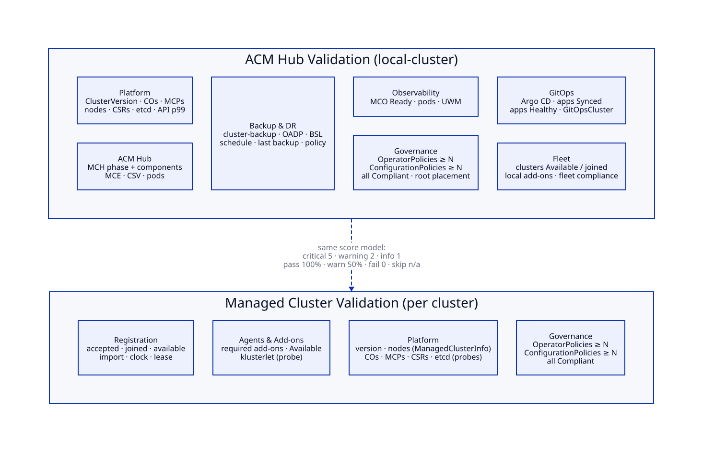

# Cluster readiness checklist

What fleet-validator checks, and what we could add next. Every implemented row is a check id
in `internal/checks/catalog.go`, a row in the dashboard table of its section, and a
`fleetvalidator_check_state{check="<id>"}` series.

**Scoring.** Weights are critical 5, warning 2, info 1. A pass scores the full weight, a warn half,
and a fail zero. A **skip** (API not installed, probe policy not placed, no data) is left out of
the score. A cluster is **READY** when no *critical* check fails.



## 1. ACM hub (local-cluster)

Read directly on the hub with the pod's ServiceAccount (read-only ClusterRole
`fleet-validator-reader`). The etcd DB size and API p99 checks also query the in-cluster Thanos
querier, which needs `cluster-monitoring-view`.

| Section | Check id | Severity | Passes when | oc equivalent |
|---|---|---|---|---|
| Platform | `hub.platform.clusterversion` | critical | Available, not Failing (Progressing → warn) | `oc get clusterversion` |
| Platform | `hub.platform.clusteroperators` | critical | all Available=True, Degraded=False (Progressing → warn) | `oc get co` |
| Platform | `hub.platform.mcp` | critical | none Degraded (not Updated → warn) | `oc get mcp` |
| Platform | `hub.platform.nodes` | critical | all Ready (pressure / cordoned → warn) | `oc get nodes` |
| Platform | `hub.platform.csr` | warning | no Pending CSR older than 15m (newer → warn) | `oc get csr` |
| Platform | `hub.platform.etcd-members` | critical | every `app=etcd` pod ready, `EtcdMembersAvailable=True` | `oc get pods -n openshift-etcd` |
| Platform | `hub.platform.etcd-db-size` | warning | largest member < 1 GiB (warn), < 6 GiB (fail) | `etcd_mvcc_db_total_size_in_bytes` |
| Platform | `hub.platform.api-latency` | warning | p99 of GET/POST/PUT/PATCH/DELETE < 1s | `apiserver_request_duration_seconds` |
| ACM Hub | `hub.acm.mch-phase` | critical | MultiClusterHub `status.phase=Running` | `oc get mch -A` |
| ACM Hub | `hub.acm.mch-components` | critical | every `status.components[*].status=True` | `oc get mch -o yaml` |
| ACM Hub | `hub.acm.mce` | critical | MultiClusterEngine `phase=Available` | `oc get mce` |
| ACM Hub | `hub.acm.csv` | critical | `advanced-cluster-management` CSV Succeeded | `oc get csv -n open-cluster-management` |
| ACM Hub | `hub.acm.pods` | critical | all pods in `open-cluster-management` ready | `oc get pods -n open-cluster-management` |
| ACM Hub | `hub.acm.mce-pods` | critical | all pods in `multicluster-engine` ready | `oc get pods -n multicluster-engine` |
| Backup & DR | `hub.backup.enabled` | critical | MCH override `cluster-backup: enabled` | `oc get mch -o yaml` |
| Backup & DR | `hub.backup.oadp` | critical | `oadp-operator` CSV Succeeded in `open-cluster-management-backup` | `oc get csv -n open-cluster-management-backup` |
| Backup & DR | `hub.backup.storage-location` | critical | every BackupStorageLocation `phase=Available` | `oc get bsl -n open-cluster-management-backup` |
| Backup & DR | `hub.backup.schedule` | critical | BackupSchedule `phase=Enabled` (BackupCollision → fail) | `oc get backupschedule -n open-cluster-management-backup` |
| Backup & DR | `hub.backup.recent` | warning | a velero Backup Completed within 26h | `oc get backup.velero.io -n open-cluster-management-backup` |
| Backup & DR | `hub.backup.policy` | warning | Red Hat built-in policy `backup-restore-enabled` Compliant | `oc get policy -n open-cluster-management-backup` |
| Observability | `hub.obs.mco` | warning | MultiClusterObservability `Ready=True` | `oc get mco` |
| Observability | `hub.obs.pods` | warning | all pods in `open-cluster-management-observability` ready | `oc get pods -n open-cluster-management-observability` |
| Observability | `hub.obs.uwm` | info | `enableUserWorkload: true` (the fleet-validator metrics path) | `oc get cm cluster-monitoring-config -n openshift-monitoring` |
| Governance | `hub.gov.policies-bound` | critical | at least one policy placed on local-cluster | `oc get policy -n local-cluster` |
| Governance | `hub.gov.operator-policies` | critical | ≥ `minOperatorPolicies` OperatorPolicy templates on local-cluster | same |
| Governance | `hub.gov.configuration-policies` | critical | ≥ `minConfigurationPolicies` ConfigurationPolicy templates | same |
| Governance | `hub.gov.compliant` | critical | every placed policy Compliant (pending → warn) | same |
| Governance | `hub.gov.root-placement` | warning | every enabled root policy reaches at least one cluster | `oc get policy -A` |
| GitOps | `hub.gitops.argocd` | warning | every ArgoCD instance `phase=Available` | `oc get argocd -A` |
| GitOps | `hub.gitops.apps-synced` | warning | every Application Synced | `oc get applications.argoproj.io -A` |
| GitOps | `hub.gitops.apps-healthy` | warning | every Application Healthy (Progressing/Suspended → warn) | same |
| GitOps | `hub.gitops.gitopscluster` | info | every GitOpsCluster `phase=successful` (none → skip) | `oc get gitopscluster -A` |
| Fleet | `hub.fleet.available` | critical | every ManagedCluster Available | `oc get managedclusters` |
| Fleet | `hub.fleet.joined` | warning | every ManagedCluster accepted + joined | same |
| Fleet | `hub.fleet.local-addons` | warning | local-cluster add-ons Available, not Degraded | `oc get managedclusteraddons -n local-cluster` |
| Fleet | `hub.fleet.fleet-compliance` | warning | no NonCompliant replicated policy on any cluster | `oc get policy -A` |

## 2. Managed cluster (one per ManagedCluster)

Only clusters that are at least **accepted and joined** are validated. Everything is read on the hub:

- the ManagedCluster conditions, its lease, add-ons and `ManagedClusterInfo`;
- the **probe policy** `fleet-validator-spoke-probes`, whose inform-only ConfigurationPolicies run
  on the spoke. Their results come back through normal policy status sync, so fleet-validator
  never needs spoke credentials.

| Section | Check id | Severity | Passes when | Source |
|---|---|---|---|---|
| Registration | `mc.reg.accepted` | critical | `HubAcceptedManagedCluster=True` | ManagedCluster |
| Registration | `mc.reg.joined` | critical | `ManagedClusterJoined=True` | ManagedCluster |
| Registration | `mc.reg.available` | critical | `ManagedClusterConditionAvailable=True` | ManagedCluster |
| Registration | `mc.reg.import` | critical | `ManagedClusterImportSucceeded=True` (absent → skip) | ManagedCluster |
| Registration | `mc.reg.clock` | warning | `ManagedClusterConditionClockSynced=True` (absent → skip) | ManagedCluster |
| Registration | `mc.reg.lease` | critical | `managed-cluster-lease` renewed < 5m ago | Lease in cluster ns |
| Agents & Add-ons | `mc.agents.required-addons` | critical | `work-manager`, `governance-policy-framework`, `config-policy-controller` present | ManagedClusterAddOn |
| Agents & Add-ons | `mc.agents.addons-available` | critical | all add-ons Available (Degraded → warn) | ManagedClusterAddOn |
| Agents & Add-ons | `mc.agents.klusterlet` | critical | every Deployment in `open-cluster-management-agent` fully ready | probe `fv-probe-klusterlet-agent` |
| Platform | `mc.platform.version` | critical | OpenShift version reported, no failed upgrade (upgrading → warn) | ManagedClusterInfo |
| Platform | `mc.platform.nodes` | critical | every node Ready | ManagedClusterInfo |
| Platform | `mc.platform.co-available` | critical | no ClusterOperator `Available=False` | probe `fv-probe-clusteroperators-available` |
| Platform | `mc.platform.co-degraded` | critical | no ClusterOperator `Degraded=True` | probe `fv-probe-clusteroperators-not-degraded` |
| Platform | `mc.platform.mcp-degraded` | critical | no MachineConfigPool `Degraded=True` | probe `fv-probe-mcp-not-degraded` |
| Platform | `mc.platform.mcp-updated` | warning | no MachineConfigPool `Updated=False` | probe `fv-probe-mcp-updated` |
| Platform | `mc.platform.csr` | warning | no Pending CSR | probe `fv-probe-no-pending-csr` |
| Platform | `mc.platform.etcd` | critical | `etcd/cluster` `EtcdMembersAvailable=True` | probe `fv-probe-etcd-members` |
| Governance | `mc.gov.policies-bound` | critical | at least one policy placed (probe policy excluded) | Policies in cluster ns |
| Governance | `mc.gov.operator-policies` | critical | ≥ `minOperatorPolicies` OperatorPolicy templates | same |
| Governance | `mc.gov.configuration-policies` | critical | ≥ `minConfigurationPolicies` ConfigurationPolicy templates | same |
| Governance | `mc.gov.compliant` | critical | every placed policy Compliant (pending → warn) | same |

**Governance minimums** are set in the config (`governance.default`, `governance.clusters.<name>`).
They can also be set per cluster with ManagedCluster annotations, which lets the provisioning flow
write them onto the cluster:

```yaml
metadata:
  annotations:
    fleet-validator.dasmlab.org/min-operator-policies: "1"
    fleet-validator.dasmlab.org/min-configuration-policies: "6"
    # fleet-validator.dasmlab.org/skip: "true"   # leave this cluster out entirely
```

## 3. Backlog: candidate checks not implemented yet

Grouped by where the data would come from. Items marked **MCO** need ACM Observability and would
query the hub Thanos for spoke metrics (the default MCO allowlist already carries most of them).

| Area | Candidate | Hub | Managed | Source |
|---|---|:-:|:-:|---|
| Security | kubeadmin secret removed, at least one IdP on `oauth/cluster` | ✓ | ✓ | API / probe |
| Security | etcd encryption on (`apiserver/cluster spec.encryption`) | ✓ | ✓ | API / probe |
| Security | API / ingress / service-CA certificates not expiring < 30d | ✓ | ✓ | API / probe |
| Platform | critical alerts firing (`ALERTS{severity="critical"}`) | ✓ | ✓ | Thanos / **MCO** |
| Platform | etcd DB size and API p99 for spokes | | ✓ | **MCO** |
| Platform | default StorageClass present, image registry managed | ✓ | ✓ | API / probe |
| Platform | ClusterVersion channel set, no stuck upgrade, updates available | ✓ | ✓ | API / ManagedClusterInfo |
| Platform | NTP/chrony MachineConfig present | ✓ | ✓ | probe |
| ACM Hub | MCH `availabilityConfig: High`, ≥ 3 control-plane nodes | ✓ | | API |
| ACM Hub | ACM/MCE Subscription `installPlanApproval: Manual`, no InstallPlan waiting | ✓ | | API |
| ACM Hub | search-v2, console plugins, cluster-proxy healthy | ✓ | | API |
| ACM Hub | ClusterImageSets present for the target OpenShift versions | ✓ | | API |
| Backup & DR | restore tested within N days (`Restore` CR history) | ✓ | | API |
| Backup & DR | passive hub reachable / restore-sync configured | ✓ | | API |
| Fleet | klusterlet version matches the hub | | ✓ | ManagedCluster status |
| Fleet | observability add-on actually forwarding (last `up` sample age in Thanos) | | ✓ | **MCO** |
| Insights | no critical Insights recommendations (PolicyReports) | ✓ | ✓ | see [design/insights](design/insights/README.md) |
| Resilience | Krkn resiliency score ≥ baseline | | ✓ | see [design/krkn](design/krkn/README.md) |
