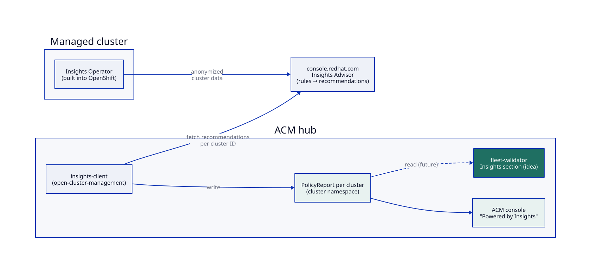

# DESIGN DISCUSSION: Red Hat Insights in fleet-validator

> Status: **discussion, no code.** This is a stretch item, so the doc stays high level: what
> Insights is, how ACM already surfaces it, and how a small fleet-validator section could use it.

Reference shared for this item: [Red Hat Sales Hub content](https://saleshub.redhat.com/app?ContentId=2296414f-8e19-4e60-a964-9af47cf1a17f)
(behind the Red Hat login; not reviewed for this draft). The description below comes from the
public ACM and OpenShift documentation, so check it against that deck in the review.

## What it is

- Every connected OpenShift cluster runs the **Insights Operator**. It periodically sends
  anonymized configuration and health data to Red Hat.
- **Insights Advisor** (console.redhat.com) runs Red Hat's rule set against that data and returns
  **recommendations**: known bugs, misconfigurations and upgrade risks, each with a **total risk**
  of *critical*, *important*, *moderate* or *low*, and a remediation article.
- In ACM, the hub's **insights-client** fetches the recommendations for each managed cluster and
  stores them as **PolicyReport** objects in the cluster's namespace. The ACM console shows them
  as the "Powered by Insights" panel on the Overview page and as issues on each cluster.

**Limitation:** clusters must be connected (telemetry / Insights Operator enabled, `cloud.openshift.com`
in the pull secret). Disconnected clusters get no recommendations. That is a readiness question in itself.

## How fleet-validator could use it

It would add a small **Insights** section to both dashboards, read from what ACM already stores on the hub:

| Candidate check | Passes when | Severity |
|---|---|---|
| `*.insights.connected` | ClusterOperator `insights` Available and not disabled (probe on spokes, direct on hub) | warning |
| `*.insights.critical` | no *critical* recommendation in the cluster's PolicyReport | critical |
| `*.insights.important` | no *important* recommendation (otherwise warn, with the rule names in the detail) | warning |
| `*.insights.fresh` | the PolicyReport was updated within 24h | info |

It would add no new data flow, no new credentials and no calls to console.redhat.com from our
pod: the hub already has the data. The detail column would list the rule names so an operator can
open the matching Advisor article.

## Open questions

1. Are our target clusters (lab and customer) connected, or do we need a disconnected story?
2. Should a *critical* recommendation block READY, or only lower the score?
3. Do we want to suppress specific rules per cluster (accepted risk), for example through an annotation?
4. Is the PolicyReport format stable across the ACM versions we run? Check on the lab hub:
   `oc get policyreports -A`.
