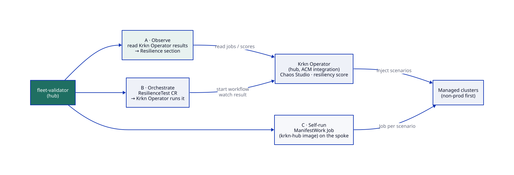
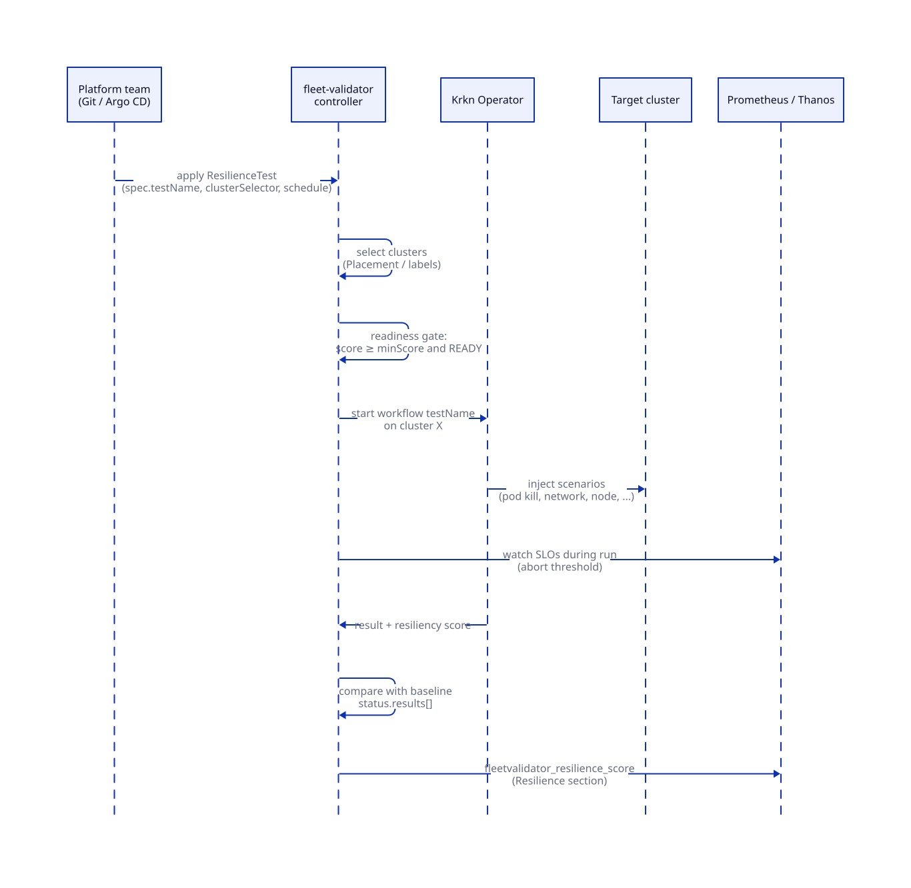

# DESIGN DISCUSSION: Krkn chaos testing in fleet-validator

> Status: **discussion, no code yet.** This is for the team review. Nothing here is committed
> scope. Where the Krkn Operator API is described, it is our reading of a developer preview and
> must be verified before we build on it.

Source: [Kubernetes chaos engineering at scale: Krkn Operator Developer Preview in Red Hat Advanced Cluster Management](https://developers.redhat.com/articles/2026/08/17/krkn-operator-developer-preview-red-hat-acm) (Red Hat Developer, 2026-08-17).

## 1. Why this belongs next to the readiness checklist

The checklist answers **"is the cluster configured and healthy right now?"** Chaos testing answers
**"does it recover when something breaks?"** A cluster can be 100% green and still take ten
minutes to recover from a lost router pod. The two fit together:

- run chaos **only** on clusters the validator already calls READY (never pile a fault on a broken cluster);
- report the result as another dashboard section (**Resilience**), with a score compared to a baseline.

## 2. What Krkn gives us (from the article)

| Piece | What it does |
|---|---|
| **Krkn** (CNCF project) | Kubernetes/OpenShift chaos scenarios: pod, node, network, storage, service disruption, resource pressure. |
| **Krkn Operator** (developer preview) | Installed on the ACM hub with Helm (`acm.enabled=true`). Discovers ACM/OCM ManagedClusters as targets, runs experiments against them, keeps results. |
| **Console** | Pick target clusters and a scenario from the registry, set parameters, run, follow it on the **Jobs** page. |
| **Chaos Studio** | Visual editor: each node is a scenario, edges make them sequential or parallel. Builds reusable **workflows**. |
| **Resiliency score** | During a workflow, Chaos Studio evaluates Prometheus metrics (availability, latency, error rate, throughput, recovery time) and produces a score. Run it on a known-good cluster to set a **baseline**, then rerun after upgrades or config changes and compare. |

The article's install, for reference (non-production first):

```bash
helm install krkn-operator oci://quay.io/krkn-chaos/charts/krkn-operator \
  --version <VERSION> --namespace krkn-operator-system --create-namespace \
  --set console.route.enabled=true --set acm.enabled=true
oc get pods -n krkn-operator-system
oc get managedclusters
```

## 3. Integration options



### A. Observe: read Krkn results (smallest step)

fleet-validator reads the Krkn Operator's job/workflow results on the hub and adds a
**Resilience** section to the managed-cluster dashboard:

| Check | Passes when |
|---|---|
| `mc.resilience.last-run` | last workflow run on this cluster succeeded, within N days |
| `mc.resilience.score` | resiliency score ≥ baseline − tolerance (warn below, fail far below) |

- **Pro:** no new CRD, no chaos triggered by us, and it works with whatever the team runs in Chaos Studio.
- **Con:** depends on how the operator exposes results (CR status, API, or only its console). **To verify.**

### B. Orchestrate: a `ResilienceTest` CRD (the idea from the kickoff)

fleet-validator gets its first CRD. A platform team declares *what* to run and *where*; the
controller decides *when it's safe*, asks the Krkn Operator to run it, and records the score.

```yaml
apiVersion: fleet-validator.dasmlab.org/v1alpha1
kind: ResilienceTest
metadata:
  name: app-pod-disruption
  namespace: fleet-validator
spec:
  testName: app-pod-disruption        # Chaos Studio workflow (or single Krkn scenario) to run
  clusterSelector:                    # or placementRef: {name: non-prod-clusters}
    matchLabels:
      environment: staging
  schedule: "0 3 * * 6"               # optional; omit = run once per spec change
  gate:
    requireReady: true                # fleet-validator READY (no critical failure)
    minScore: 90                      # readiness score before we inject anything
  baseline:
    score: 82                         # from a known-good run; empty = first run sets it
    tolerance: 5
  maxConcurrentClusters: 1            # blast radius
  abort:
    promQL: 'sum(rate(haproxy_backend_http_responses_total{code="5xx"}[1m])) > 5'
status:
  results:
    - cluster: mo-lab
      startedAt: "2026-10-03T03:00:04Z"
      phase: Succeeded                # Skipped (gate) | Running | Succeeded | Failed | Aborted
      resiliencyScore: 84
      baselineDelta: +2
```

Flow:



- **Pro:** tests live in Git next to the policies and roll out through the same Argo CD → ACM
  loop. The readiness gate and blast-radius limits are enforced in one place, and results land in
  the same Grafana.
- **Con:** we own a controller and a CRD. It is coupled to the Krkn Operator's trigger API, which is
  still a developer preview.

### C. Self-run: ManifestWork Jobs with the krkn-hub images

Skip the Krkn Operator. For each target cluster, fleet-validator creates a `ManifestWork` holding a
Job that runs a krkn-hub scenario image, then reads the outcome through ManifestWork status feedback.

- **Pro:** no operator dependency; works on a hub where we can't install the preview.
- **Con:** we rebuild what the operator already does (scenario catalog, workflow ordering, scoring,
  console). The spoke Job needs strong RBAC, and we would have to ship it with care.

### Recommendation for discussion

1. **Lab first:** install the Krkn Operator on the lab hub, then run the pod-disruption hypothesis
   from the article ("replicas and availability restored within the recovery window") on one
   non-prod cluster.
2. **Build A:** it is small and tells us exactly what results the operator exposes.
3. **Decide on B** once A shows the result API is stable enough. Keep **C** as a fallback only.

## 4. Safety rules (any option)

- Non-production clusters first; opt-in by label (`fleet-validator.dasmlab.org/chaos: "allowed"`),
  never by default. The hub (local-cluster) is always excluded.
- **Readiness gate:** skip the run if the cluster is not READY or its score is below `minScore`, and
  record `phase: Skipped` with the reason.
- One cluster at a time by default (`maxConcurrentClusters: 1`), plus optional change windows.
- Abort on an SLO breach (`abort.promQL`) and report `Aborted`.
- Audit: a Kubernetes Event on the ResilienceTest and on the ManagedCluster for every start and stop.

## 5. Metrics and dashboard (sketch)

| Metric | Labels |
|---|---|
| `fleetvalidator_resilience_score` | managed_cluster, test |
| `fleetvalidator_resilience_baseline_delta` | managed_cluster, test |
| `fleetvalidator_resilience_last_run_timestamp_seconds` | managed_cluster, test, phase |

The managed-cluster dashboard gets a **Resilience** row: last score vs baseline per test, the
score over time, and runs that were skipped by the gate.

## 6. Open questions for the team

1. How does the Krkn Operator expose results: CRs we can read, a REST API, or only its console?
2. Can a Chaos Studio workflow be started from outside the console (CR or API)? That decides B.
3. Where do baselines live: in the ResilienceTest spec (Git) or learned from the first good run?
4. Which clusters are allowed at all (labels, cluster sets)? Does prod ever qualify, even read-only?
5. Who owns the Prometheus SLO queries per application (the resiliency score's inputs)?
6. Does a failed resilience run affect the READY flag, or only the score? (Proposal: score only.)
